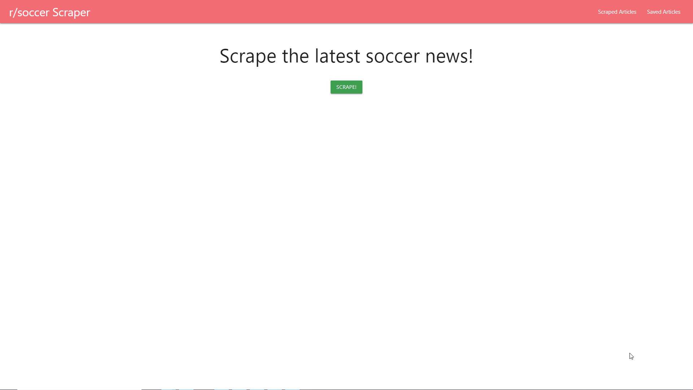

# r-soccer-scraper

r/soccer scraper scrapes the current hot page of r/soccer and posts the results on the application. Results can be saved into a favorites page, where they can also be removeed from that page. In addition, for each article there is a link to the content. 

## Technologies Used
* jQuery
* Materialize (CSS framework)
* express
* express-handlebars
* mongoose
* cheerio
* axios

## Authors
* Alfred Chan